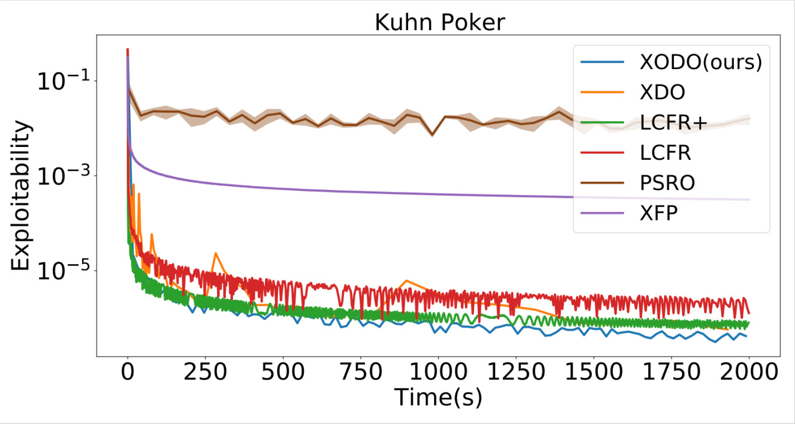
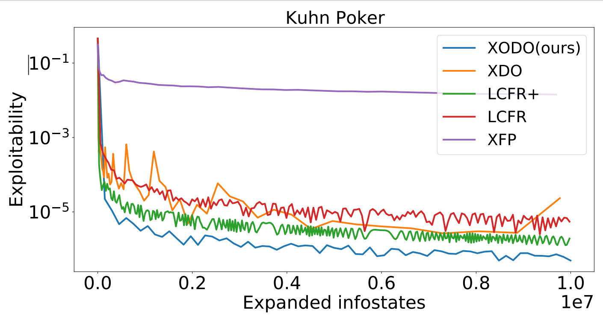

# Online Double Oracle: From Normal-Form to Extensive-Form Games

This repository is the implementation of Extensive-Form Online Double Oracle. Check the implementation of Normal-Form Online Double Oracle: https://github.com/npvoid/OnlineDoubleOracle

> Online Double Oracle (ODO) is a new learning algorithm for two-player zero-sum games where the number of pure strategies is huge or even infinite. Specifically, we combine no-regret analysis from online learning with double oracle methods from game theory. ODO achieves the regret bound  with k being the size of the effective strategy set which is linearly dependent on the support size of Nash equilibrium. Our method can be efficiently extended to extensive form games in which Extensive ODO (XODO). In extensive form game such as Kuhn Poker,Oshi Zumo and a variant of Leduc Poker, XODO shows state-of-the-art performance interms of convergence rate to the Nash Equilibrium.


## Before running
### Clone the repo with git submodules
```
git clone --recursive https://github.com/xiaohangt/ODO.git
cd ODO
git submodule update --init --recursive
```

### Set up environments:
```
conda env create -f environment.yml
conda activate xodo
```

### Install dependency(OpenSpiel)
```
# Starting at the repo root
cd dependencies/open_spiel
export BUILD_WITH_ACPC=ON # to compile with the optional universal poker game variant
./install.sh
pip install -e . # This will start a compilation process. Will take a few minutes.
```

## Running Experiments
### Exploitability
To run Extensive-Form Online Double Oracle(with Linear CFR+ as meta solver) and other baselines on Kuhn Poker:
```
python experiments.py -g kuhn_poker -a xodo -m lcfr_plus
python experiments.py -g kuhn_poker -a xdo -m lcfr_plus
python experiments.py -g kuhn_poker -a lcfr_plus
python experiments.py -g kuhn_poker -a lcfr
python experiments.py -g kuhn_poker -a xfp
python experiments.py -g kuhn_poker -a psro
```
Results will be saved in the folder `results` as list. An example result of exploitability in terms of wall time and exanded infostates:




To run experiments on  Leduc Poker, Dummy Leduc Poker, Oshi Zumo, just need to replace the argument `kuhn_poker` to `leduc_poker`, `leduc_poker_dummy`, `oshi_zumo`

### Exploitation
To get the result of XOSO and other baselines exploit fixed opponents:
```
python experiments.py -g kuhn_poker -a xodo_eps -m lcfr_plus
python experiments.py -g kuhn_poker -a lcfr_plus_eps
python experiments.py -g kuhn_poker -a cfr_eps
```
Results will also be saved in the folder `results` as list. File names are ended by `eps_list.npy`